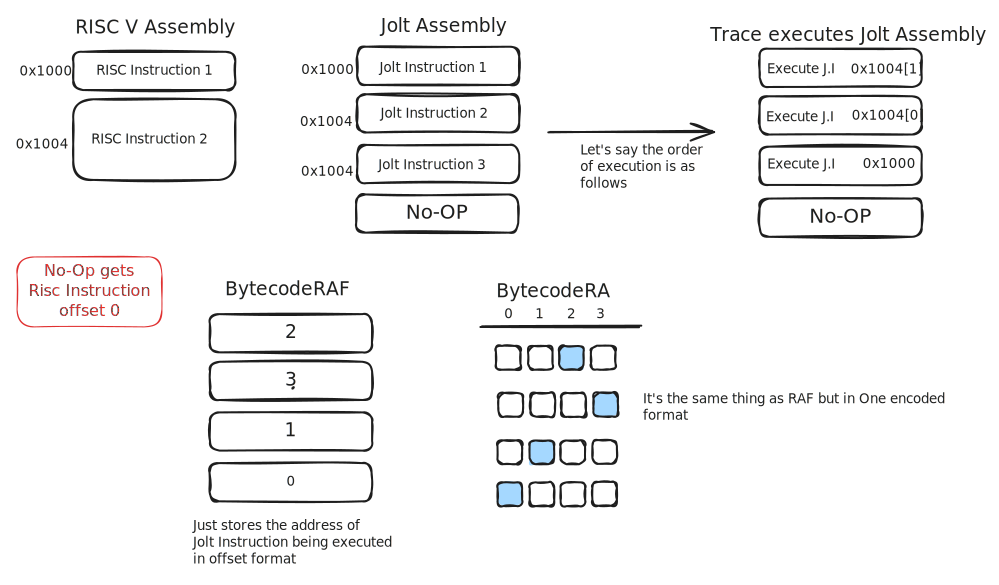

+++
title = "Emulation"
weight = 3
+++

## Overview 


sequenceDiagram
    participant JC as Jolt Compiler
    participant JE as Jolt Emulator
    participant JP as Jolt Prover Data Structures
    participant JCon as Jolt Constraints



The goal of this chapter is to go from a sequence of instructions in Jolt assembly to a trace of execution, and then to a set of data structures which we will refer to as committed and virtual polynomials. 
We refer to them as polynomials because that's exactly what they are, but in this chapter, quite intentionally we will refer to them as data structures - or more specifically arrays and matrices. 
As we are emulating an entire CPU there is a lot of code that gets run in this section. 
However, as this series is about understanding "how Jolt works", and not so much how it is implemented exactly, we abstract over some implementation details — such as how they implemented a memory-efficient tracer.

In the [Jolt Blog](@/blog/_index.md) series we cover implementation details which discuss several optimisations made to make sure the Jolt prover runs as fast as possible.
Still we will briefly outline the code sections that get invoked, so the interested reader can investigate in their own time, and validate that the written word in this chapter does indeed reflect reality.

The mental model for emulation is what you would expect of a physical CPU.


TODO: A little excerpt on what this image shows -- leave it be for now

To internalise this trace generation process let us look at a couple actual real world Jolt instructions being traced. 

## Worked Out Examples


In what follows, we describe the RISC-V instruction, the corresponding Jolt Assembly version of the RISC-V instruction, and then its execution trace.
As the names of registers in the RISC-V assembly and the Jolt assembly are slightly different,
we give a partial map that enables us to walk through both sets of code.


| Number | ABI Name | Purpose |
|--------|----------|---------|
| x0 | zero | Always 0 |
| x1 | ra | Return address |
| x2 | sp | Stack pointer |
| x10 | a0 | Arg 0 / Return value 0 |
| x11 | a1 | Arg 1 / Return value 1 |
| x12 | a2 | Arg 2 |
| x13 | a3 | Arg 3 |
| x14 | a4 | Arg 4 |


We continue with our recurring example of the Fibonacci Rust program.

### First Instruction Execution 

We start with the first instruction in the RISC-V assembly code.

```asm
80000000:	00001117          	auipc	sp,0x1
```

which as we have extensively discussed in the [Compilation](@/jolt-walkthrough/1_compilation/index.md) chapter, gets transformed into Jolt-assembly as follows:

```rust
AUIPC(AUIPC { address: 2147483648, operands: FormatU { rd: 2, imm: 4096 }, virtual_sequence_remaining: None, is_first_in_sequence: false, is_compressed: false })
```

```rust
let (_lazy_trace, trace, _, program_io) = program.trace(&serialized_input, &[], &[]);
```

There is no virtual expansion to deal with. 
The program counter is at `pc= 2147483648 = 0x80000000`. 
In RISC-V, AUIPC sets `rd = pc + (imm << 12)`. In the Jolt assembly format, the shift is already applied and stored in the immediate field, so the computation is simply `rd = pc + imm`.
So after execution, the only change to the system we expect is that the stack pointer `sp` (register `x2` in Jolt) is updated.

```rust
AUIPC(
        RISCVCycle { 
            instruction: AUIPC { address: 2147483648, operands: FormatU { rd: 2, imm: 4096 }, 
                         virtual_sequence_remaining: None, 
                         is_first_in_sequence: false, 
                        is_compressed: false }, 
            register_state: RegisterStateFormatU { rd: (0, 2147487744) }, 
            ram_access: () 
    }
)
```

The first field is just the instruction being executed. 
This instruction does not touch memory, so `ram_access` is empty.
Finally the `register_state` says this instruction was in `FormatU` (see [Instruction Formats](@/references/instruction-format.md) for details), and we store the before and after value.
At the start all registers are set to 0, so before is set to 0. 
After should be `2147483648 + 4096 = 2147487744` as instructed.
And that's all there is to the `Cycle` struct. 


### Instruction with Memory Access and Expansion

We now shift our attention to a RISC-V instruction that is expanded into a sequence of Jolt instructions.
Consulting our [ISA](@/references/jolt-isa.md) we get:

> LB (Load Byte): Loads an 8-bit byte from memory at `rs1 + offset`, sign-extending the result into `rd`.

```asm
80000044:	00050583          	lb	a1,0(a0) # 0x7fffa000
```

Instead of a single `RISCVCycle`, we should expect several, all sharing the same address, with the `virtual_sequence_remaining` field counting down through the expansion sequence.

Looking at the table above `a0` maps to register number 10, and `a1` which is our destination maps to register 11.
So the first thing to check is what is stored at the address given by the contents of `rs1` (`a0`).
Now the disassembler gives us a hint that the contents of `a0 + 0 = 0x7FFFA000 = 2147459072`

So we are reading at the right address, and we read all 64 bits of memory starting at that address.
In Line 3 we see that we have `ram_access: RAMRead { address: 2147459072, value: 1619328 }`

So the memory looks like this (`1619328 = 0x18B580`):


| LSB |  |  |  |  |  |  | MSB |
|:---:|:---:|:---:|:---:|:---:|:---:|:---:|:---:|
| 0x80 | 0xB5 | 0x18 | 0x00 | 0x00 | 0x00 | 0x00 | 0x00 |

| Decimal    | Address    | Value | Description |
|------------|------------|-------|-------------|
| 2147459072 | 0x7fffa000 | 0x80  | LSB (Byte 0)|
| 2147459073 | 0x7fffa001 | 0xB5  | Byte 1      |
| 2147459074 | 0x7fffa002 | 0x18  | Byte 2      |
| 2147459075 | 0x7fffa003 | 0x00  | Byte 3      |
| 2147459076 | 0x7fffa004 | 0x00  | Byte 4      |
| 2147459077 | 0x7fffa005 | 0x00  | Byte 5      |
| 2147459078 | 0x7fffa006 | 0x00  | Byte 6      |
| 2147459079 | 0x7fffa007 | 0x00  | MSB (Byte 7)|


Jolt's memory is little-endian, so the byte that goes into `a1` here is `0x80`.
Sign-extended, this is `0xFFFFFFFFFFFFFF80`, which is −128 as a signed 64-bit integer in two's complement.
Interpreted as an unsigned 64-bit integer, it would be `18446744073709551488`.


```rust,linenos
    ADDI(RISCVCycle { instruction: ADDI { address: 2147483716, operands: FormatI { rd: 32, rs1: 10, imm: 0 }, virtual_sequence_remaining: Some(7), is_first_in_sequence: true, is_compressed: false }, register_state: RegisterStateFormatI { rd: (0, 2147459072), rs1: 2147459072 }, ram_access: () })
    ANDI(RISCVCycle { instruction: ANDI { address: 2147483716, operands: FormatI { rd: 33, rs1: 32, imm: 18446744073709551608 }, virtual_sequence_remaining: Some(6), is_first_in_sequence: false, is_compressed: false }, register_state: RegisterStateFormatI { rd: (0, 2147459072), rs1: 2147459072 }, ram_access: () })
    LD(RISCVCycle { instruction: LD { address: 2147483716, operands: FormatLoad { rd: 34, rs1: 33, imm: 0 }, virtual_sequence_remaining: Some(5), is_first_in_sequence: false, is_compressed: false }, register_state: RegisterStateFormatLoad { rd: (0, 1619328), rs1: 2147459072 }, ram_access: RAMRead { address: 2147459072, value: 1619328 } })
    XORI(RISCVCycle { instruction: XORI { address: 2147483716, operands: FormatI { rd: 35, rs1: 32, imm: 7 }, virtual_sequence_remaining: Some(4), is_first_in_sequence: false, is_compressed: false }, register_state: RegisterStateFormatI { rd: (0, 2147459079), rs1: 2147459072 }, ram_access: () })
    VirtualMULI(RISCVCycle { instruction: VirtualMULI { address: 2147483716, operands: FormatI { rd: 35, rs1: 35, imm: 8 }, virtual_sequence_remaining: Some(3), is_first_in_sequence: false, is_compressed: false }, register_state: RegisterStateFormatI { rd: (2147459079, 17179672632), rs1: 2147459079 }, ram_access: () })
    VirtualPow2(RISCVCycle { instruction: VirtualPow2 { address: 2147483716, operands: FormatI { rd: 36, rs1: 35, imm: 0 }, virtual_sequence_remaining: Some(2), is_first_in_sequence: false, is_compressed: false }, register_state: RegisterStateFormatI { rd: (0, 72057594037927936), rs1: 17179672632 }, ram_access: () })
    MUL(RISCVCycle { instruction: MUL { address: 2147483716, operands: FormatR { rd: 11, rs1: 34, rs2: 36 }, virtual_sequence_remaining: Some(1), is_first_in_sequence: false, is_compressed: false }, register_state: RegisterStateFormatR { rd: (0, 9223372036854775808), rs1: 1619328, rs2: 72057594037927936 }, ram_access: () })
    VirtualSRAI(RISCVCycle { instruction: VirtualSRAI { address: 2147483716, operands: FormatVirtualRightShiftI { rd: 11, rs1: 11, imm: 18374686479671623680 }, virtual_sequence_remaining: Some(0), is_first_in_sequence: false, is_compressed: false }, register_state: RegisterStateFormatVirtualI { rd: (9223372036854775808, 18446744073709551488), rs1: 9223372036854775808 }, ram_access: () })
```


Now if you look at the last `rd` value in the instruction we see it has `18446744073709551488`.
We step through the trace to illustrate this.

#### Step 1: ADDI - Get effective address
Adds the sign-extended 12-bit immediate to register `rs1`. Arithmetic overflow is ignored and the result is simply the low `XLEN` bits of the result.

```rust
asm.emit_i::<ADDI>(*v_address, self.operands.rs1, self.operands.imm as u64);
// v_address = 0x7FFFA000
// Confirmed: RegisterStateFormatI { rd: (0, 2147459072), rs1: 2147459072 }
```

#### Step 2: ANDI - Align to dword boundary
Performs bitwise AND on register `rs1` and the sign-extended 12-bit immediate and places the result in `rd`. This clears the last 3 bits.

```rust
asm.emit_i::<ANDI>(*v_dword_address, *v_address, -8i64 as u64);
// v_dword_address = 0x7FFFA000
// Confirmed: RegisterStateFormatI { rd: (0, 2147459072), rs1: 2147459072 }
```

#### Step 3: LD - Load dword from memory
Loads a 64-bit value from memory into register `rd` for RV64I.

```rust
asm.emit_ld::<LD>(*v_dword, *v_dword_address, 0);
// v_dword = 0x000000000018B580 = 1619328
//             MSB                                              LSB
// v_dword = | 0x00 | 0x00 | 0x00 | 0x00 | 0x00 | 0x18 | 0xB5 | 0x80 |
// Confirmed: RegisterStateFormatLoad { rd: (0, 1619328), rs1: 2147459072 }
//            ram_access: RAMRead { address: 2147459072, value: 1619328 }
```

#### Step 4: XORI - Calculate byte offset from MSB
Performs bitwise XOR on register `rs1` and the sign-extended 12-bit immediate and places the result in `rd`. Flips the lowest 3 bits (originally 000, now 111).

```rust
asm.emit_i::<XORI>(*v_shift, *v_address, 7);
// v_shift = 0x7FFFA007 = 2147459079
// Confirmed: RegisterStateFormatI { rd: (0, 2147459079), rs1: 2147459072 }
```

#### Step 5: VirtualMULI - Convert byte offset to bit offset
Multiplies the value in register `rs1` by 8 (equivalent to SLLI by 3).

```rust
asm.emit_virtual::<VirtualMULI>(*v_shift, *v_shift, 8);
// v_shift = 0x3FFFFD0038 = 17179672632
// Lowest 6 bits of v_shift are now 111000 = 56
// Confirmed: RegisterStateFormatI { rd: (2147459079, 17179672632), rs1: 2147459079 }
```

#### Step 6: VirtualPow2 - Calculate shift mask
Computes 2^(v_shift) to create a power-of-2 value.

```rust
asm.emit_virtual::<VirtualPow2>(*v_pow2, *v_shift, 0);
// v_pow2 = 2^56 = 0x100000000000000 = 72057594037927936
// Confirmed: RegisterStateFormatI { rd: (0, 72057594037927936), rs1: 17179672632 }
```

#### Step 7: MUL - Shift byte to MSB position
Multiplies v_dword by 2^56, effectively shifting the target byte to the MSB position.

```rust
asm.emit_r::<MUL>(self.operands.rd, *v_dword, *v_pow2);
// v_dword = 0x000000000018B580 * 2^56 = 0x8000000000000000
// rd = | 0x80 | 0x00 | 0x00 | 0x00 | 0x00 | 0x00 | 0x00 | 0x00 |
// Confirmed: RegisterStateFormatR { rd: (0, 9223372036854775808), rs1: 1619328, rs2: 72057594037927936 }
```

#### Step 8: VirtualSRAI - Sign-extend from MSB
Performs arithmetic right shift on the value in register `rs1` by 56 bits. The sign bit is copied into the vacated upper bits.

```rust
asm.emit_virtual::<VirtualSRAI>(self.operands.rd, self.operands.rd, 56);
// rd = 0x8000000000000000 >> (s) 56 = 0xFFFFFFFFFFFFFF80
// rd = | 0xFF | 0xFF | 0xFF | 0xFF | 0xFF | 0xFF | 0xFF | 0x80 |
// rd = -128 (signed) = 18446744073709551488 (unsigned)
// Confirmed: RegisterStateFormatVirtualI { rd: (9223372036854775808, 18446744073709551488), rs1: 9223372036854775808 }
```

*Final Result*: `rd = 0xFFFFFFFFFFFFFF80 = -128` (as expected)


## The RISCVCycle Data Structure

So there it is — the trace is really a list of records of what the CPU did per instruction (padded with `No-OP`s to make the length a power of 2).
If we wanted to examine the `Cycle` struct in code - it's a bookkeeping device. 
We list the instruction being run, the registers being used, the immediate values, and the before and after state of all the registers that change; and the before/after state of memory.
That's all there is to it.

```rust
LD(RISCVCycle 
    { 
        instruction: LD { 
            address: 2147483716, 
            operands: FormatLoad { rd: 34, rs1: 33, imm: 0 }, 
            virtual_sequence_remaining: Some(5), 
            is_first_in_sequence: false, 
            is_compressed: false 
        }, 
        register_state: RegisterStateFormatLoad { rd: (0, 1619328), rs1: 2147459072 }, 
        ram_access: RAMRead { address: 2147459072, value: 1619328 } 
    }
)

```

Formally it is just 

```rust
pub struct RISCVCycle<T: RISCVInstruction> {
    pub instruction: T,
    pub register_state: <T::Format as InstructionFormat>::RegisterState,
    pub ram_access: T::RAMAccess,
}
```

where we have already covered instructions in detail (see [Jolt ISA](@/references/jolt-isa.md)).
`RegisterState` is just any type that implements the trait 

```rust
pub trait InstructionRegisterState:
    Default + Copy + Clone + Serialize + DeserializeOwned + Debug
{
    fn rs1_value(&self) -> Option<u64> {
        None
    }
    fn rs2_value(&self) -> Option<u64> {
        None
    }
    fn rd_values(&self) -> Option<(u64, u64)> {
        None
    }
}
```

It just gives the before and after values of registers.
And `RAMAccess` is also self-explanatory.

```rust
#[derive(Default, Debug, Copy, Clone, Serialize, Deserialize, PartialEq)]
pub struct RAMRead {
    pub address: u64,
    pub value: u64,
}

#[derive(Default, Debug, Copy, Clone, Serialize, Deserialize, PartialEq)]
pub struct RAMWrite {
    pub address: u64,
    pub pre_value: u64,
    pub post_value: u64,
}

pub enum RAMAccess {
    Read(RAMRead),
    Write(RAMWrite),
    NoOp,
}
```




**Summarising**: So what the Jolt CPU does (and we do not cover how in this section) is take all the instructions in Jolt assembly, execute them, and create a record of what it did.
This record will act as the ground truth of what the Jolt VM did when given a user program.
If the reader is interested in looking into the block of code that actually executes each Jolt instruction, they can inspect `tracer/src/instruction/mod.rs`.

All we need to remember is that Jolt took the user program, compiled it to Jolt assembly, executed each instruction, and kept a log of everything it did at every time step.
Jolt also saves the initial state of memory, and the final state of memory after all instructions are run.
From this `trace` (executions) and the initial and final memory state, we will create the data structures described below.



If the reader wanted to better understand how exactly we emulate each instruction, we refer you to `tracer/src/instruction/mod.rs`.
It essentially relies on the execute function we write for each instruction.
This is where looking at the operands or formatting will be useful.

```rust
    fn trace(&self, cpu: &mut Cpu, trace: Option<&mut Vec<Cycle>>) {
        let mut cycle: RISCVCycle<Self> = RISCVCycle {
            instruction: *self,
            register_state: Default::default(),
            ram_access: Default::default(),
        };
        self.operands()
            .capture_pre_execution_state(&mut cycle.register_state, cpu);
        self.execute(cpu, &mut cycle.ram_access);
        self.operands()
            .capture_post_execution_state(&mut cycle.register_state, cpu);
        if let Some(trace_vec) = trace {
            trace_vec.push(cycle.into());
        }
    }
```

Based on the format of the instruction, each of them will have a pre/post execution state capture.

```rust
// FORMAT R: will want to extract this for everything else.
fn capture_pre_execution_state(&self, state: &mut Self::RegisterState, cpu: &mut Cpu) {
        state.rs1 = normalize_register_value(cpu.x[self.rs1 as usize], &cpu.xlen);
        state.rs2 = normalize_register_value(cpu.x[self.rs2 as usize], &cpu.xlen);
        state.rd.0 = normalize_register_value(cpu.x[self.rd as usize], &cpu.xlen);
    }

    fn capture_post_execution_state(&self, state: &mut Self::RegisterState, cpu: &mut Cpu) {
        state.rd.1 = normalize_register_value(cpu.x[self.rd as usize], &cpu.xlen);
    }
```


## Jolt Specific Data Structures.

We have finished executing the program -- and generated a `trace` that records everything we have done. 
The next thing we want to do is use this trace to construct a few data structures that facilitate proving. 
The inputs to this phase are simply the `trace` vector and the initial and final memory state.



There is a large body of code that gets us from a trace to the data structures we are about to define.
Once again we are abstracting implementation details, as we want to get to the conceptual core of proving.
Later in a more specific blog post, we will detail how the prover was implemented. 




TODO: Put in mermaid digram 

The first set of data structures we discuss are what we call the "committed polynomials".
They are named

1. `RdInc`
2. `RamInc`
3. `BytecodeRa(d)`
4. `RamRa(d)`
5. `InstructionRa(d)`

Before proceeding to describe what these data structures look like, we introduce some notation.
Let $T$ be the length of the `trace` padded with `NoOp` cycles to make $T$ a power of 2.

These five polynomial families are all variants of the `CommittedPolynomial` enum ([`witness.rs:22`](https://github.com/a16z/jolt/blob/main/jolt-core/src/zkvm/witness.rs#L22)):

```rust
pub enum CommittedPolynomial {
    RdInc,
    RamInc,
    BytecodeRa(usize),
    RamRa(usize),
    InstructionRa(usize),
    // ...
}
```

### 1. `RdInc` -- Register Increment Polynomial

A length-$T$ array of `i128` (signed integers).

**Cell $j$** stores how much the destination register changed at cycle $j$:
- If cycle $j$ wrote to a register: $\texttt{RdInc}[j] = \texttt{rd\\\_post} - \texttt{rd\\\_pre}$
- If cycle $j$ did not write any register (NoOp or read-only): $\texttt{RdInc}[j] = 0$

This is computed in [`witness.rs:75`](https://github.com/a16z/jolt/blob/main/jolt-core/src/zkvm/witness.rs#L75):

```rust
CommittedPolynomial::RdInc => {
    let row: Vec<i128> = row_cycles
        .iter()
        .map(|cycle| {
            let (_, pre_value, post_value) = cycle.rd_write().unwrap_or_default();
            post_value as i128 - pre_value as i128
        })
        .collect();
    PCS::process_chunk(setup, &row)
}
```


where `rd_write()` calls 

```rust
if let Some((rd_pre_val, rd_post_val)) = cycle.register_state.rd_values() 
```

defined in `jolt/tracer/src/instruction/mod.rs` — which we know from the `InstructionRegisterState` trait shown above just returns the before and after values.



So that's all there is to the `RdInc` data structure. It is an array of length number of Jolt Instructions (padded to a power of 2) which at location $j$ contains the difference between the start and finish values of the destination register written to at time $j$.



### 2. `RamInc` -- RAM Increment Polynomial

From the above example, you can already guess that `RamInc` will be similar. Instead of the destination register, this will store in cell $j$ the difference between the before and after values at the memory location updated by the $j$'th Jolt instruction.

**Cell $j$** stores how much memory changed at cycle $j$:
- If cycle $j$ was a store (write): $\texttt{RamInc}[j] = \texttt{post\\\_value} - \texttt{pre\\\_value}$
- If cycle $j$ was a load (read) or NoOp: $\texttt{RamInc}[j] = 0$

Loads contribute 0 because a load does not change memory.

This is computed in [`witness.rs:85`](https://github.com/a16z/jolt/blob/main/jolt-core/src/zkvm/witness.rs#L85):

```rust
CommittedPolynomial::RamInc => {
    let row: Vec<i128> = row_cycles
        .iter()
        .map(|cycle| match cycle.ram_access() {
            tracer::instruction::RAMAccess::Write(write) => {
                write.post_value as i128 - write.pre_value as i128
            }
            _ => 0,
        })
        .collect();
    PCS::process_chunk(setup, &row)
}
```

Only the `Write` variant of `RAMAccess` produces a nonzero value; `Read` and `NoOp` both map to 0.

### 3. `BytecodeRa(d)`

Now we get into something more involved.
The remaining three data structures -- `BytecodeRa`, `RamRa`, and `InstructionRa` -- have a parameter $d$ associated with them.
We will set $d=1$ for now, and re-introduce the general version in a bit.
To best understand what is going on it's better to talk about a different version of the above data structures. 
Let's use `BytecodeRa` as the motivating example, which we refer to simply as `ra` for short.
First we will define another array called `raf` of size $T$, where `raf[j]` stores the PC address of the $j$'th instruction. 

Consider the following toy example: 

We have our RISC-V assembly, and our corresponding Jolt Assembly. 
Here the total number of instructions is 3 which when padded to the next power of 2 we denote with $K$ is 4, and the total number of cycles or instructions the program ran for is 3 (padded to 4, which will be $T$).
Instruction number 2 is expanded into 2 instructions by our Jolt Assembly converter. 
In our toy example, assume that memory starts at `0x1000` so we show both the physical addresses and offsets (which are written inside the rectangles). 
In the figure J.I refers to Jolt Instruction.



Then we show an example trace where we run Jolt Instructions 2, 3 and 1 in that order. 
The `raf` array is just a size $T$ array where location $i$ stores what Jolt Instruction was read at cycle number $i$ in offset format (so don't store the physical address, but instead store the offset).
`ra` is just `raf` stored in 1-hot encoding format.
That's all there is to it.

Now what happens when **$d > 1$?**


In this toy program, we have $K$ quite small and manageable, but a real program might have millions of instructions. 
If we wanted to one-hot encode that in `ra` we would be looking at very very long rows. 
Note that this does not affect `raf` which in each cell is just a `u64` number -- it does not care if $K=4$ or $2^{32}$.
It uses the same space. 
Now we need to store this one hot encoded version of `raf` for this thing called polynomial commitments we will get to later, but for now assume that we NEED one hot encoding, but we also cannot afford to have very very long rows. 
So here's what we will do -- we will write the number stored in cell/location of `raf` as a $d$ digit base $N$ number, where $N = K^{1/d}$. As $K$ is a power of 2, $d$ must divide $\log_2 K$ so that $N$ is also a power of 2.
See figure below where $K=16$ and $d=2$ so we express addresses as a 2 digit base 4 number.


Once we do that -- we just store each digit as a one-hot encoded matrix. 
That's it -- there's a lot of code in the Jolt code base that essentially does this transformation. 


In summary, `BytecodeRa` stores $d$ matrices of dimension $T \times K^{1/d}$ where the rows of all matrices are one hot encoded.
Row $i$, matrix $j$ denotes the $j$'th digit of the expanded Jolt PC stored in offset format. 



This one hot encoding process is identical for `InstructionRa` and `RamRa` as well. 
The only thing that will be different is what the corresponding `InstructionRaf` and `RamRaf` store.
So let's get to that. 


### 4. `RamRa(d)` -- RAM Address One-Hot Polynomials

For this section, we will describe the `Raf` version of the `Ra` data structure. 
We already know how to go from `Raf` to `Ra` by the above description. 
That part is the exact same.

`RamRaf` is an array of size $T$ (length of `trace` padded to the next power of 2) - where `RamRaf[t] = Addr as u64`, where `Addr` is the address the instruction is loading or storing bytes to and from.
If the instruction for time $t$ is not interacting with memory, we set `Addr = 0`. 
Of course, based on the lowest and highest memory address the trace accesses, we get a size of memory we need to maintain which defines $K$ -- the length of rows in one-hot encoded form.
If this $K$ is very large -- there is a corresponding $d$ again. 
But this is exactly what we described above.

### 5. `InstructionRa(d)` -- Instruction Lookup Address One-Hot Polynomials

Once again we only discuss the `Raf` version. 
To understand `InstructionRaf` we need to understand a fundamental concept in Jolt.
Consider the instruction `AND a3, a4, a5` where we are storing in register `a3` the bitwise AND of values in `a4` and `a5`.
Further, `a4= 10 as u64` and `a5 = 123 as u64`. 
The Jolt thing to do is make a giant table of size $2^{128}$ (we don't actually manifest this table, but for where we are in this tutorial, pretend that we do).
128 bits as the inputs are 64 bits each, so the product space is of size $2^{128}$.
This table stores the `AND(x,y)` output for every possible value of $x$ and $y$.
In the example above, $x=10$ and $y=123$ as 64-bit strings.
So for this $x$ and $y$ there will be a single row of the giant table that has the correct answer. 


**This is at the heart of the Jolt zk-VM: almost every instruction is secretly a lookup into a giant table.** We will dive into the lookup nature of Jolt in great detail in later chapters.


So just like for `RamRa` at timestep $t$ we store the address read at time $t$, here we will take our two 64-bit inputs $x$ and $y$ and make an address out of it by interleaving the bits.
For example, let $x = 10$ and $y = 123$. We show only the lowest 8 bits since the upper 56 bits are all zero for both:

```
Bit position:     7    6    5    4    3    2    1    0

x = 10  (64-bit): 0    0    0    0    1    0    1    0
y = 123 (64-bit): 0    1    1    1    1    0    1    1

Interleaved (128-bit):
  x7 y7  x6 y6  x5 y5  x4 y4  x3 y3  x2 y2  x1 y1  x0 y0
   0  0   0  1   0  1   0  1   1  1   0  0   1  1   0  1
```

Reading left to right, the interleaved address is `...00 01 01 01 11 00 11 01` in binary.
This 128-bit address uniquely identifies the row in the giant `AND` table where the answer `AND(10, 123) = 2` lives.

So `InstructionRaf` also stores an address -- an address formed by taking the inputs and making an address out of it.
At this address, in our giant table lies the answer to output that is stored in destination register `a3`.


There are two more things -- called trusted and untrusted advice -- that we need to construct.
But for now we ignore them.
We'll get back to them we promise.




