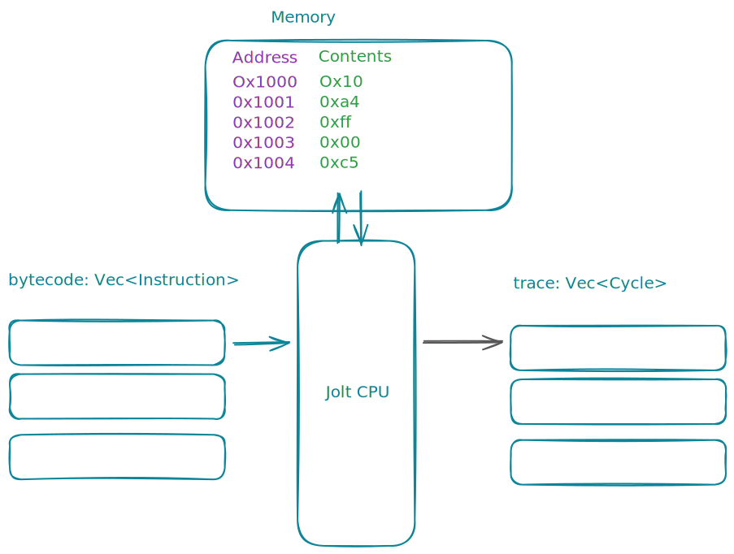
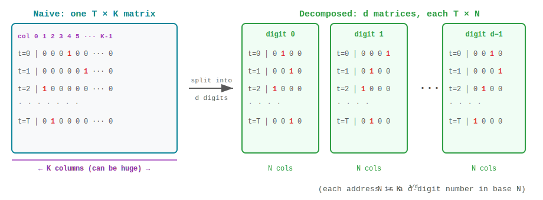

+++
title = "Emulation"
weight = 3
+++

## Overview 


sequenceDiagram
    participant JC as Jolt Compiler
    participant JE as Jolt Emulator
    participant JP as Jolt Prover Data Structures
    participant JCon as Jolt Constraints



The goal of this chapter is to go from a sequence of instructions in Jolt assembly to a trace of execution, and then to a set of data structures which we will refer to as committed and virtual polynomials. 
We refer to them as polynomials because that's exactly what they are, but in this chapter, quite intentionally we will refer to them as data structures - or more specifically arrays and matrices. 
As we are emulating an entire CPU there is a lot of code that gets run in this section. 
However, as this series is about understanding "how Jolt works", and not so much how it is implemented exactly, we abstract over some implementation details — such as how they implemented a memory-efficient tracer.

In the [Jolt Blog](@/blog/_index.md) series we cover implementation details which discuss several optimisations made to make sure the Jolt prover runs as fast as possible.
Still we will briefly outline the code sections that get invoked, so the interested reader can investigate in their own time, and validate that the written word in this chapter does indeed reflect reality.

The mental model for emulation is what you would expect of a physical CPU.



TODO: A little excerpt on what this image shows -- leave it be for now

To internalise this trace generation process let us look at a couple actual real world Jolt instructions being traced. 

## Worked Out Examples


In what follows, we describe the RiSCV instruction, the corresponding Jolt Assembly version of the RISC instruction, and then its execution trace. 
As the name of registers in the RISC-V assembly and the Jolt assembly is slightly different, 
we give a partial map that enables us to walk through both sets of code.


| Number | ABI Name | Purpose |
|--------|----------|---------|
| x0 | zero | Always 0 |
| x1 | ra | Return address |
| x2 | sp | Stack pointer |
| x10 | a0 | Arg 0 / Return value 0 |
| x11 | a1 | Arg 1 / Return value 1 |
| x12 | a2 | Arg 2 |
| x13 | a3 | Arg 3 |
| x14 | a4 | Arg 4 |


We continue with our recurring example of the Fibonacci Rust program.

### First Instruction Execution 

We start with the first instruction in the RISC-V assembly code.

```asm
80000000:	00001117          	auipc	sp,0x1
```

which as we have extensively discussed in the [Compilation](@/jolt-walkthrough/1_compilation/index.md) chapter, gets transformed into Jolt-assembly as follows:

```rust
AUIPC(AUIPC { address: 2147483648, operands: FormatU { rd: 2, imm: 4096 }, virtual_sequence_remaining: None, is_first_in_sequence: false, is_compressed: false })
```

```rust
let (_lazy_trace, trace, _, program_io) = program.trace(&serialized_input, &[], &[]);
```

There is no virtual expansion to deal with. 
The program counter is at `pc= 2147483648 = 0x80000000`. 
The instruction sets the destination register `rd = pc + (imm << 12)`. In the Jolt assembly format, the shift is already applied and stored in the immediate field.
So after execution, the only change to the system we expect is that the stack pointer `sp` (register `x2` in Jolt) is updated.

```rust
AUIPC(
        RISCVCycle { 
            instruction: AUIPC { address: 2147483648, operands: FormatU { rd: 2, imm: 4096 }, 
                         virtual_sequence_remaining: None, 
                         is_first_in_sequence: false, 
                        is_compressed: false }, 
            register_state: RegisterStateFormatU { rd: (0, 2147487744) }, 
            ram_access: () 
    }
)
```

The first field is just the instruction being executed. 
This instruction does not touch memory, so `ram_access` is empty.
Finally the `register_state` says this instruction was in `FormatU` (see [Instruction Formats](@/references/instruction-format.md) for details), and we store the before and after value.
At the start all registers are set to 0, so before is set to 0. 
After should be `2147483648 + 4096 = 2147487744` as instructed.
And that's all there is to the `Cycle` struct. 


### Instruction with Memory Access and Expansion

We now shift our attention to a RISC-V instruction that is expanded into a sequence of Jolt instructions.
Consulting our [ISA](@/references/jolt-isa.md) we get:

> LB (Load Byte): Loads an 8-bit byte from memory at `rs1 + offset`, sign-extending the result into `rd`.

```asm
80000044:	00050583          	lb	a1,0(a0) # 0x7fffa000
```

Instead of a single `RISCVCycle`, we should expect several, all sharing the same address, with the `virtual_sequence_remaining` field counting down through the expansion sequence.

Looking at the table above `a0` maps to register number 10, and `a1` which is our destination maps to register 11.
So the first thing to check is what is stored at the address given by the contents of `rs1` (`a0`).
Now the disassembler gives us a hint that the contents of `a0 + 0 = 0x7FFFA000 = 2147459072`

So we are reading at the right address, and we read all 64 bits of memory starting at that address.
In Line 3 we see that we have `ram_access: RAMRead { address: 2147459072, value: 1619328 }`

So the memory looks like this: as `1619328 = 0x18B580`


| LSB |  |  |  |  |  |  | MSB |
|:---:|:---:|:---:|:---:|:---:|:---:|:---:|:---:|
| 0x80 | 0xB5 | 0x18 | 0x00 | 0x00 | 0x00 | 0x00 | 0x00 |

| Decimal    | Address    | Value | Description |
|------------|------------|-------|-------------|
| 2147459072 | 0x7fffa000 | 0x80  | LSB (Byte 0)|
| 2147459073 | 0x7fffa001 | 0xB5  | Byte 1      |
| 2147459074 | 0x7fffa002 | 0x18  | Byte 2      |
| 2147459075 | 0x7fffa003 | 0x00  | Byte 3      |
| 2147459076 | 0x7fffa004 | 0x00  | Byte 4      |
| 2147459077 | 0x7fffa005 | 0x00  | Byte 5      |
| 2147459078 | 0x7fffa006 | 0x00  | Byte 6      |
| 2147459079 | 0x7fffa007 | 0x00  | MSB (Byte 7)|


Jolt's memory is little-endian, so the byte that goes into `a1` here is `0x80`.
Sign-extended, this is `0xFFFFFFFFFFFFFF80`, which is −128 as a signed 64-bit integer in two's complement.
Interpreted as an unsigned 64-bit integer, it would be `18446744073709551488`.


```rust,linenos
    ADDI(RISCVCycle { instruction: ADDI { address: 2147483716, operands: FormatI { rd: 32, rs1: 10, imm: 0 }, virtual_sequence_remaining: Some(7), is_first_in_sequence: true, is_compressed: false }, register_state: RegisterStateFormatI { rd: (0, 2147459072), rs1: 2147459072 }, ram_access: () })
    ANDI(RISCVCycle { instruction: ANDI { address: 2147483716, operands: FormatI { rd: 33, rs1: 32, imm: 18446744073709551608 }, virtual_sequence_remaining: Some(6), is_first_in_sequence: false, is_compressed: false }, register_state: RegisterStateFormatI { rd: (0, 2147459072), rs1: 2147459072 }, ram_access: () })
    LD(RISCVCycle { instruction: LD { address: 2147483716, operands: FormatLoad { rd: 34, rs1: 33, imm: 0 }, virtual_sequence_remaining: Some(5), is_first_in_sequence: false, is_compressed: false }, register_state: RegisterStateFormatLoad { rd: (0, 1619328), rs1: 2147459072 }, ram_access: RAMRead { address: 2147459072, value: 1619328 } })
    XORI(RISCVCycle { instruction: XORI { address: 2147483716, operands: FormatI { rd: 35, rs1: 32, imm: 7 }, virtual_sequence_remaining: Some(4), is_first_in_sequence: false, is_compressed: false }, register_state: RegisterStateFormatI { rd: (0, 2147459079), rs1: 2147459072 }, ram_access: () })
    VirtualMULI(RISCVCycle { instruction: VirtualMULI { address: 2147483716, operands: FormatI { rd: 35, rs1: 35, imm: 8 }, virtual_sequence_remaining: Some(3), is_first_in_sequence: false, is_compressed: false }, register_state: RegisterStateFormatI { rd: (2147459079, 17179672632), rs1: 2147459079 }, ram_access: () })
    VirtualPow2(RISCVCycle { instruction: VirtualPow2 { address: 2147483716, operands: FormatI { rd: 36, rs1: 35, imm: 0 }, virtual_sequence_remaining: Some(2), is_first_in_sequence: false, is_compressed: false }, register_state: RegisterStateFormatI { rd: (0, 72057594037927936), rs1: 17179672632 }, ram_access: () })
    MUL(RISCVCycle { instruction: MUL { address: 2147483716, operands: FormatR { rd: 11, rs1: 34, rs2: 36 }, virtual_sequence_remaining: Some(1), is_first_in_sequence: false, is_compressed: false }, register_state: RegisterStateFormatR { rd: (0, 9223372036854775808), rs1: 1619328, rs2: 72057594037927936 }, ram_access: () })
    VirtualSRAI(RISCVCycle { instruction: VirtualSRAI { address: 2147483716, operands: FormatVirtualRightShiftI { rd: 11, rs1: 11, imm: 18374686479671623680 }, virtual_sequence_remaining: Some(0), is_first_in_sequence: false, is_compressed: false }, register_state: RegisterStateFormatVirtualI { rd: (9223372036854775808, 18446744073709551488), rs1: 9223372036854775808 }, ram_access: () })
```


Now if you look at the last `rd` value in the instruction we see it has `18446744073709551488`
We step through the trace to illustrate this.

#### Step 1: ADDI - Get effective address
Adds the sign-extended 12-bit immediate to register `rs1`. Arithmetic overflow is ignored and the result is simply the low `XLEN` bits of the result.

```rust
asm.emit_i::<ADDI>(*v_address, self.operands.rs1, self.operands.imm as u64);
// v_address = 0x7FFFA000
// Confirmed: RegisterStateFormatI { rd: (0, 2147459072), rs1: 2147459072 }
```

#### Step 2: ANDI - Align to dword boundary
Performs bitwise AND on register `rs1` and the sign-extended 12-bit immediate and places the result in `rd`. This clears the last 3 bits.

```rust
asm.emit_i::<ANDI>(*v_dword_address, *v_address, -8i64 as u64);
// v_dword_address = 0x7FFFA000
// Confirmed: RegisterStateFormatI { rd: (0, 2147459072), rs1: 2147459072 }
```

#### Step 3: LD - Load dword from memory
Loads a 64-bit value from memory into register `rd` for RV64I.

```rust
asm.emit_ld::<LD>(*v_dword, *v_dword_address, 0);
// v_dword = 0x0000000000018B580 = 1619328
//             MSB                                              LSB
// v_dword = | 0x00 | 0x00 | 0x00 | 0x00 | 0x00 | 0x18 | 0xB5 | 0x80 |
// Confirmed: RegisterStateFormatLoad { rd: (0, 1619328), rs1: 2147459072 }
//            ram_access: RAMRead { address: 2147459072, value: 1619328 }
```

#### Step 4: XORI - Calculate byte offset from MSB
Performs bitwise XOR on register `rs1` and the sign-extended 12-bit immediate and places the result in `rd`. Flips the lowest 3 bits (originally 000, now 111).

```rust
asm.emit_i::<XORI>(*v_shift, *v_address, 7);
// v_shift = 0x7FFFA007 = 2147459079
// Confirmed: RegisterStateFormatI { rd: (0, 2147459079), rs1: 2147459072 }
```

#### Step 5: VirtualMULI - Convert byte offset to bit offset
Multiplies the value in register `rs1` by 8 (equivalent to SLLI by 3).

```rust
asm.emit_virtual::<VirtualMULI>(*v_shift, *v_shift, 8);
// v_shift = 0x3FFFFD0038 = 17179672632
// Lowest 6 bits of v_shift are now 111000 = 56
// Confirmed: RegisterStateFormatI { rd: (2147459079, 17179672632), rs1: 2147459079 }
```

#### Step 6: VirtualPow2 - Calculate shift mask
Computes 2^(v_shift) to create a power-of-2 value.

```rust
asm.emit_virtual::<VirtualPow2>(*v_pow2, *v_shift, 0);
// v_pow2 = 2^56 = 0x100000000000000 = 72057594037927936
// Confirmed: RegisterStateFormatI { rd: (0, 72057594037927936), rs1: 17179672632 }
```

#### Step 7: MUL - Shift byte to MSB position
Multiplies v_dword by 2^56, effectively shifting the target byte to the MSB position.

```rust
asm.emit_r::<MUL>(self.operands.rd, *v_dword, *v_pow2);
// v_dword = 0x0000000000018B580 * 2^56 = 0x8000000000000000
// rd = | 0x80 | 0x00 | 0x00 | 0x00 | 0x00 | 0x00 | 0x00 | 0x00 |
// Confirmed: RegisterStateFormatR { rd: (0, 9223372036854775808), rs1: 1619328, rs2: 72057594037927936 }
```

#### Step 8: VirtualSRAI - Sign-extend from MSB
Performs arithmetic right shift on the value in register `rs1` by 56 bits. The sign bit is copied into the vacated upper bits.

```rust
asm.emit_virtual::<VirtualSRAI>(self.operands.rd, self.operands.rd, 56);
// rd = 0x8000000000000000 >> (s) 56 = 0xFFFFFFFFFFFFFF80
// rd = | 0xFF | 0xFF | 0xFF | 0xFF | 0xFF | 0xFF | 0xFF | 0x80 |
// rd = -128 (signed) = 18446744073709551488 (unsigned)
// Confirmed: RegisterStateFormatVirtualI { rd: (9223372036854775808, 18446744073709551488), rs1: 9223372036854775808 }
```

*Final Result*: `rd = 0xFFFFFFFFFFFFFF80 = -128` (as expected)


## The RISCVCycle Data Structure

So there it is the trace is really a list of record of what the CPU did per instruction (padded with `No-OP`s to make the length a power of 2).
If we wanted to examine the `Cycle` struct in code - it's a bookkeeping device. 
We list the instruction being run, the registers being used, the immediate values, and the before and after state of all the registers that change; and the before/after state of memory.
That's all there is to it.

```rust
LD(RISCVCycle 
    { 
        instruction: LD { 
            address: 2147483716, 
            operands: FormatLoad { rd: 34, rs1: 33, imm: 0 }, 
            virtual_sequence_remaining: Some(5), 
            is_first_in_sequence: false, 
            is_compressed: false 
        }, 
        register_state: RegisterStateFormatLoad { rd: (0, 1619328), rs1: 2147459072 }, 
        ram_access: RAMRead { address: 2147459072, value: 1619328 } 
    }
)

```

Formally it is just 

```rust
pub struct RISCVCycle<T: RISCVInstruction> {
    pub instruction: T,
    pub register_state: <T::Format as InstructionFormat>::RegisterState,
    pub ram_access: T::RAMAccess,
}
```

where we have already covered instruction in detail (see [Jolt ISA](@/references/jolt-isa.md)).
`RegisterState` is just any type that implements the trait 

```rust
pub trait InstructionRegisterState:
    Default + Copy + Clone + Serialize + DeserializeOwned + Debug
{
    fn rs1_value(&self) -> Option<u64> {
        None
    }
    fn rs2_value(&self) -> Option<u64> {
        None
    }
    fn rd_values(&self) -> Option<(u64, u64)> {
        None
    }
}
```

It just gives the before and after values of registers.
And `RAMAccess` is also self-explanatory.

```rust
#[derive(Default, Debug, Copy, Clone, Serialize, Deserialize, PartialEq)]
pub struct RAMRead {
    pub address: u64,
    pub value: u64,
}

#[derive(Default, Debug, Copy, Clone, Serialize, Deserialize, PartialEq)]
pub struct RAMWrite {
    pub address: u64,
    pub pre_value: u64,
    pub post_value: u64,
}

pub enum RAMAccess {
    Read(RAMRead),
    Write(RAMWrite),
    NoOp,
}
```




**Summarising**: So what the Jolt CPU does (and we do not cover how in this section) is take all the instructions in Jolt assembly, execute them, and create a record of what it did.
This record will act as the ground truth of what the Jolt VM did when given a user program.
If the reader is interested in looking into the block of code that actually executes each Jolt instruction they can inspect 

All we need to remember, is that Jolt took the user program compiled it to Jolt assembly, executed each instruction, and kept a log of everything it did at every time step.
Jolt also saves the initial state of memory, and the final state of memory after all instructions are run.
From this `trace` (executions) and `memory` initial, and final -- we will create the following data structures: 




If the reader wanted to better understand how exactly we emulate each instruction, we refer you to `tracer/src/instruction/mod.rs`.
It essentially relies on the execute function we write for each instruction.
This is where looking a the operands or formatting will be useful.

```rust
    fn trace(&self, cpu: &mut Cpu, trace: Option<&mut Vec<Cycle>>) {
        let mut cycle: RISCVCycle<Self> = RISCVCycle {
            instruction: *self,
            register_state: Default::default(),
            ram_access: Default::default(),
        };
        self.operands()
            .capture_pre_execution_state(&mut cycle.register_state, cpu);
        self.execute(cpu, &mut cycle.ram_access);
        self.operands()
            .capture_post_execution_state(&mut cycle.register_state, cpu);
        if let Some(trace_vec) = trace {
            trace_vec.push(cycle.into());
        }
    }
```

Based on the format of the instruction, each of them will have a pre/post execution state capture.

```rust
// FORMAT R: will want to extract this for everything else.
fn capture_pre_execution_state(&self, state: &mut Self::RegisterState, cpu: &mut Cpu) {
        state.rs1 = normalize_register_value(cpu.x[self.rs1 as usize], &cpu.xlen);
        state.rs2 = normalize_register_value(cpu.x[self.rs2 as usize], &cpu.xlen);
        state.rd.0 = normalize_register_value(cpu.x[self.rd as usize], &cpu.xlen);
    }

    fn capture_post_execution_state(&self, state: &mut Self::RegisterState, cpu: &mut Cpu) {
        state.rd.1 = normalize_register_value(cpu.x[self.rd as usize], &cpu.xlen);
    }
```


## Jolt Specific Data Structures.

We have finished executing the program -- and generated a `trace` that records everything we have done. 
The next thing we want to do is use this trace to construct a few data structures that facilitate proving. 
The inputs to to this phase, our simply the `trace` vector and the initial and final memory state. 



There is a large body of code that gets us from a trace to the data structures we are about to define.
Once again we are abstracting implementation details, as we want to get to how the conceptual core of proving. 
Later in a more specific blog post, we will detail how the prover was implemented. 




TODO: Put in mermaid digram 

The first set of data structures we discuss are what we call the "committed polynomials".
They are named

1. `RdInc`
2. `RamInc`
3. `InstructionRa(d)`
4. `BytecodeRa(d)`
5. `RamRa(d)`

Before proceeding to describe what these data structures look like, we introduce some notation.
Let $T$ be the length of the `trace` padded with `NoOp` cycles to make $T$ a power of 2.

These five polynomial families are all variants of the `CommittedPolynomial` enum ([`witness.rs:22`](https://github.com/a16z/jolt/blob/main/jolt-core/src/zkvm/witness.rs#L22)):

```rust
pub enum CommittedPolynomial {
    RdInc,
    RamInc,
    InstructionRa(usize),
    BytecodeRa(usize),
    RamRa(usize),
    // ...
}
```

### 1. `RdInc` -- Register Increment Polynomial

A length-$T$ array of `i128` (signed integers).

**Cell $j$** stores how much the destination register changed at cycle $j$:
- If cycle $j$ wrote to a register: $\texttt{RdInc}[j] = \texttt{rd\\\_post} - \texttt{rd\\\_pre}$
- If cycle $j$ did not write any register (NoOp or read-only): $\texttt{RdInc}[j] = 0$

This is computed in [`witness.rs:75`](https://github.com/a16z/jolt/blob/main/jolt-core/src/zkvm/witness.rs#L75):

```rust
CommittedPolynomial::RdInc => {
    let row: Vec<i128> = row_cycles
        .iter()
        .map(|cycle| {
            let (_, pre_value, post_value) = cycle.rd_write().unwrap_or_default();
            post_value as i128 - pre_value as i128
        })
        .collect();
    PCS::process_chunk(setup, &row)
}
```


where `rd_write()` calls 

```rust
if let Some((rd_pre_val, rd_post_val)) = cycle.register_state.rd_values() 
```

defined in `jolt/tracer/src/instruction/mod.rs` which we know from the implemented trait below just returns the before after values.

```rust

pub trait InstructionRegisterState:
    Default + Copy + Clone + Serialize + DeserializeOwned + Debug
{
    #[cfg(any(feature = "test-utils", test))]
    fn random(rng: &mut rand::rngs::StdRng, operands: &NormalizedOperands) -> Self;
    fn rs1_value(&self) -> Option<u64> {
        None
    }
    fn rs2_value(&self) -> Option<u64> {
        None
    }
    fn rd_values(&self) -> Option<(u64, u64)> {
        None
    }
}
```



So that's all there is to the `RdInc` data structure. It is an array of length number of Jolt Instructions (padded to a power of 2) which at location $j$ contains the difference between the start and finish values of the destination register written to at time $j$.



### 2. `RamInc` -- RAM Increment Polynomial

From the above example, you can already guess that `RamInc` will be similar. Instead of destination register, this will store in cell $j$ the before and after values at memory location updated by the $j$'th Jolt instruction,. 

**Cell $j$** stores how much memory changed at cycle $j$:
- If cycle $j$ was a store (write): $\texttt{RamInc}[j] = \texttt{post\\\_value} - \texttt{pre\\\_value}$
- If cycle $j$ was a load (read) or NoOp: $\texttt{RamInc}[j] = 0$

Loads contribute 0 because a load does not change memory.

This is computed in [`witness.rs:85`](https://github.com/a16z/jolt/blob/main/jolt-core/src/zkvm/witness.rs#L85):

```rust
CommittedPolynomial::RamInc => {
    let row: Vec<i128> = row_cycles
        .iter()
        .map(|cycle| match cycle.ram_access() {
            tracer::instruction::RAMAccess::Write(write) => {
                write.post_value as i128 - write.pre_value as i128
            }
            _ => 0,
        })
        .collect();
    PCS::process_chunk(setup, &row)
}
```

Only the `Write` variant of `RAMAccess` produces a nonzero value; `Read` and `NoOp` both map to 0.

### One-Hot Encoding and the Decomposition into $d$ Chunks

Now we into get something more involved. 
The remaining three data structures -- `InstructionRa`, `BytecodeRa`, and `RamRa` -- have a parameter $d$ associated with them. 
We will set $d=1$ for now, and re-introduce the general version in a bit.
To best understand what is going on it's better to talk about a different version of the above data structures. 
Let's use `BytecodeRa` as the motivating example, which we refer to simple as `ra` for short. 
First we will define another array called `raf` of size $T$, where `raf[j]` stores the PC address of the $j$'th instruction. 


Consider `BytecodeRa` as a motivating example (the others work identically).
At each cycle $t$, the CPU fetches an instruction from some bytecode address.
The naive representation would be a length-$T$ array where entry $t$ stores that address as a `u64`.
But Jolt needs something more structured: a **one-hot encoding**.

Instead of storing the raw address, we build a $T \times K$ matrix where $K$ is the total number of bytecode memory locations (padded to a power of 2).
Row $t$ is all zeros except for a single 1 in column $j$, where $j$ is the address accessed at cycle $t$.

The problem is that $K$ can be very large, making each row impractically wide.
The fix is to **decompose the address into digits**.
We write the address as a $d$-digit number in base $N = K^{1/d}$ (since everything is a power of 2, this always works out cleanly).
Now instead of one $T \times K$ matrix, we get $d$ separate $T \times N$ matrices, each one-hot encoded -- one matrix per digit of the address.



To recover the original address from the $d$ digits, we just read them off: if digit $i$ of address $a$ is $c_i$, then


$$a = \sum_{i=0}^{d-1} c_i \cdot N^{d-1-i}$$


and the full one-hot indicator for address $a$ at cycle $t$ can be reconstructed as the product of the $d$ per-digit indicators.
In Jolt's notation, $N$ is called $K_\\text{chunk}$ and $d$ varies by polynomial family.

#### Concrete Parameters

The chunk size $K_\\text{chunk}$ is chosen based on trace length ([`config.rs:135`](https://github.com/a16z/jolt/blob/main/jolt-core/src/zkvm/config.rs#L135)):

```rust
let log_k_chunk = if log_T < ONEHOT_CHUNK_THRESHOLD_LOG_T { // threshold = 25
    4
} else {
    8
};
```

The number of digits $d$ is then computed as $d = \lceil \log_2(K) / \texttt{log\\\_k\\\_chunk} \rceil$ ([`config.rs:232`](https://github.com/a16z/jolt/blob/main/jolt-core/src/zkvm/config.rs#L232)):

```rust
let instruction_d = LOG_K.div_ceil(log_k_chunk);       // LOG_K = 128 (= 2 × XLEN)
let bytecode_d = bytecode_k.log_2().div_ceil(log_k_chunk);
let ram_d = ram_k.log_2().div_ceil(log_k_chunk);
```

Putting it together:

| Parameter | $\log T < 25$ (small traces) | $\log T \geq 25$ (large traces) |
|---|---|---|
| $\texttt{log\\\_k\\\_chunk}$ | $4$ | $8$ |
| $K_\\text{chunk}$ | $16$ | $256$ |
| $d_\\text{instr}$ | $128 / 4 = 32$ | $128 / 8 = \mathbf{16}$ |
| $d_\\text{bc}$ | $\lceil \log_2(K_\\text{bc}) / 4 \rceil$ | $\lceil \log_2(K_\\text{bc}) / 8 \rceil$ |
| $d_\\text{ram}$ | $\lceil \log_2(K_\\text{ram}) / 4 \rceil$ | $\lceil \log_2(K_\\text{ram}) / 8 \rceil$ |

For instruction lookups, $d$ is always fixed because `LOG_K = 128` (two interleaved 64-bit operands, from [`instruction_lookups/mod.rs:6`](https://github.com/a16z/jolt/blob/main/jolt-core/src/zkvm/instruction_lookups/mod.rs#L6): `pub const LOG_K: usize = XLEN * 2`).
For bytecode and RAM, $d$ depends on the program -- $K_\\text{bc}$ is the bytecode table size and $K_\\text{ram}$ is the RAM address space, both padded to the next power of 2.

For our Fibonacci example ($\log T = 16$, small-trace regime), $K_\\text{chunk} = 16$ and $d_\\text{instr} = 32$.

#### How Digits Are Extracted

In code, the per-digit extraction is a simple bit-shift-and-mask. The three extraction functions live in [`config.rs:275`](https://github.com/a16z/jolt/blob/main/jolt-core/src/zkvm/config.rs#L275):

```rust
pub fn ram_address_chunk(&self, address: u64, idx: usize) -> u8 {
    ((address >> self.ram_shifts[idx]) & (self.k_chunk - 1) as u64) as u8
}

pub fn bytecode_pc_chunk(&self, pc: usize, idx: usize) -> u8 {
    ((pc >> self.bytecode_shifts[idx]) & (self.k_chunk - 1)) as u8
}

pub fn lookup_index_chunk(&self, index: u128, idx: usize) -> u8 {
    ((index >> self.instruction_shifts[idx]) & (self.k_chunk - 1) as u128) as u8
}
```

The shift arrays are precomputed in big-endian order: `shifts[i] = log_k_chunk * (d - 1 - i)` ([`config.rs:236`](https://github.com/a16z/jolt/blob/main/jolt-core/src/zkvm/config.rs#L236)).
So digit 0 extracts the most-significant chunk of the address, and digit $d-1$ extracts the least-significant chunk.

All the parameters -- $K_\\text{chunk}$, $d$, and the shift arrays -- are held in the `OneHotParams` struct ([`config.rs:206`](https://github.com/a16z/jolt/blob/main/jolt-core/src/zkvm/config.rs#L206)):

```rust
pub struct OneHotParams {
    pub log_k_chunk: usize,
    pub k_chunk: usize,

    pub bytecode_k: usize,
    pub ram_k: usize,

    pub instruction_d: usize,
    pub bytecode_d: usize,
    pub ram_d: usize,

    instruction_shifts: Vec<usize>,
    ram_shifts: Vec<usize>,
    bytecode_shifts: Vec<usize>,
    // ...
}
```

#### Internal Representation

Rather than materializing the full $T \times K_\\text{chunk}$ matrix, each one-hot matrix is stored as a `OneHotPolynomial` ([`poly/one_hot_polynomial.rs:24`](https://github.com/a16z/jolt/blob/main/jolt-core/src/poly/one_hot_polynomial.rs#L24)). It only stores which column is hot in each row:

```rust
pub struct OneHotPolynomial<F: JoltField> {
    pub K: usize,                              // k_chunk (16 or 256)
    pub nonzero_indices: Arc<Vec<Option<u8>>>,  // length T: which column is hot per row
    // ...
}
```

A `Some(j)` entry means column $j$ is hot; `None` means the entire row is zero (only occurs for `RamRa` when the cycle has no memory access).


### 3. `InstructionRa(i)` -- Instruction Lookup One-Hot Polynomials

$d_\\text{instr}$ length-$T$ arrays (16 for large traces, 32 for small ones). Each array corresponds to one digit of the decomposed lookup index.

Unlike `BytecodeRa` and `RamRa`, the "address" here is not a memory address or a program counter.
It is a 128-bit **lookup table index** formed by interleaving the *values* of the instruction's two operands (typically the contents of `rs1` and `rs2`).
For example, if at cycle $j$ the instruction has `rs1_value = 5` and `rs2_value = 3`, then the lookup index is `interleave_bits(5, 3)` -- a 128-bit number with 5's bits at even positions and 3's bits at odd positions.
This is the index into the instruction's decomposable lookup table, and it is this 128-bit value that gets decomposed into $d$ digits.

**Cell $j$ of array $i$** stores the $i$-th digit of that 128-bit lookup index at cycle $j$.

```
InstructionRa(0): [ digit₀(idx₀),  digit₀(idx₁),  digit₀(idx₂),  ...  digit₀(idx_T) ]
InstructionRa(1): [ digit₁(idx₀),  digit₁(idx₁),  digit₁(idx₂),  ...  digit₁(idx_T) ]
       ⋮                ⋮               ⋮               ⋮                    ⋮
InstructionRa(d-1): [ digit_{d-1}(idx₀), ... ]

where idx_j = interleave_bits(rs1_value_j, rs2_value_j)
```

The `to_lookup_index` method ([`instruction/mod.rs:32`](https://github.com/a16z/jolt/blob/main/jolt-core/src/zkvm/instruction/mod.rs#L32)) computes this:

```rust
fn to_lookup_index(&self) -> u128 {
    let (x, y) = LookupQuery::<XLEN>::to_lookup_operands(self);
    interleave_bits(x, y as u64)
}
```

where `interleave_bits` ([`utils/mod.rs:145`](https://github.com/a16z/jolt/blob/main/jolt-core/src/utils/mod.rs#L145)) places $x$'s bits at even positions and $y$'s bits at odd positions.
Each digit of the decomposed index corresponds to a small sub-table lookup -- this is how Jolt turns one large table lookup into $d$ small ones (the Lasso decomposition).

The witness generation extracts digit $i$ and records it as the hot column for row $j$ ([`witness.rs:97`](https://github.com/a16z/jolt/blob/main/jolt-core/src/zkvm/witness.rs#L97)):

```rust
CommittedPolynomial::InstructionRa(idx) => {
    let row: Vec<Option<usize>> = row_cycles
        .iter()
        .map(|cycle| {
            let lookup_index = LookupQuery::<XLEN>::to_lookup_index(cycle);
            Some(one_hot_params.lookup_index_chunk(lookup_index, *idx) as usize)
        })
        .collect();
    PCS::process_chunk_onehot(setup, one_hot_params.k_chunk, &row)
}
```

Every cycle always produces `Some(...)` (NoOps produce $\texttt{lookup\\\_index} = 0$), so every cell always has a value.


### 4. `BytecodeRa(i)` -- Bytecode One-Hot Polynomials

$d_\\text{bc} = \lceil \log_2(K_\\text{bc}) / \texttt{log\\\_k\\\_chunk} \rceil$ length-$T$ arrays (program-dependent count).

**Cell $j$ of array $i$** stores the $i$-th digit of the virtual PC at cycle $j$. The virtual PC is a dense sequential index into the bytecode table.

```
BytecodeRa(0): [ digit₀(pc₀),  digit₀(pc₁),  digit₀(pc₂),  ...  digit₀(pc_T) ]
BytecodeRa(1): [ digit₁(pc₀),  digit₁(pc₁),  digit₁(pc₂),  ...  digit₁(pc_T) ]
       ⋮              ⋮             ⋮              ⋮                   ⋮

where pc_j = virtual PC at cycle j  (0 for NoOps)
```

The virtual PC is computed by `get_pc` ([`bytecode/mod.rs:36`](https://github.com/a16z/jolt/blob/main/jolt-core/src/zkvm/bytecode/mod.rs#L36)):

```rust
pub fn get_pc(&self, cycle: &Cycle) -> usize {
    if matches!(cycle, tracer::instruction::Cycle::NoOp) {
        return 0;
    }
    let instr = cycle.instruction().normalize();
    self.pc_map
        .get_pc(instr.address, instr.virtual_sequence_remaining.unwrap_or(0))
}
```

which delegates to `BytecodePCMapper::get_pc` ([`bytecode/mod.rs:92`](https://github.com/a16z/jolt/blob/main/jolt-core/src/zkvm/bytecode/mod.rs#L92)) to convert the raw ELF address into a dense index. NoOps map to PC = 0 (a dummy noop row).

The witness generation extracts digit $i$ from the virtual PC ([`witness.rs:107`](https://github.com/a16z/jolt/blob/main/jolt-core/src/zkvm/witness.rs#L107)):

```rust
CommittedPolynomial::BytecodeRa(idx) => {
    let row: Vec<Option<usize>> = row_cycles
        .iter()
        .map(|cycle| {
            let pc = preprocessing.bytecode.get_pc(cycle);
            Some(one_hot_params.bytecode_pc_chunk(pc, *idx) as usize)
        })
        .collect();
    PCS::process_chunk_onehot(setup, one_hot_params.k_chunk, &row)
}
```

As with `InstructionRa`, every cell always has a value (NoOps map to PC = 0, not `None`).


### 5. `RamRa(i)` -- RAM Address One-Hot Polynomials

$d_\\text{ram} = \lceil \log_2(K_\\text{ram}) / \texttt{log\\\_k\\\_chunk} \rceil$ length-$T$ arrays (program-dependent count).

**Cell $j$ of array $i$** stores the $i$-th digit of the remapped RAM address at cycle $j$, or `None` if cycle $j$ did not access RAM at all.

```
RamRa(0): [ Some(c₀),  None,  Some(c₀'),  None,  ...  None ]
RamRa(1): [ Some(c₁),  None,  Some(c₁'),  None,  ...  None ]
       ⋮        ⋮        ⋮        ⋮          ⋮          ⋮

Some(cᵢ) = the i-th digit of the remapped RAM address
None     = no RAM access this cycle
```

The raw byte address is remapped to a word-aligned index by `remap_address` ([`ram/mod.rs:128`](https://github.com/a16z/jolt/blob/main/jolt-core/src/zkvm/ram/mod.rs#L128)):

```rust
pub fn remap_address(address: u64, memory_layout: &MemoryLayout) -> Option<u64> {
    if address == 0 {
        return None;
    }
    let lowest_address = memory_layout.get_lowest_address();
    if address >= lowest_address {
        Some((address - lowest_address) / 8)
    } else {
        panic!("Unexpected address {address}")
    }
}
```

When `address == 0`, there was no memory operation this cycle and the cell is `None`.
Otherwise the remapped address is $(\texttt{byte\\\_address} - \texttt{base}) / 8$, and the cell stores digit $i$ of that value.

The witness generation ([`witness.rs:117`](https://github.com/a16z/jolt/blob/main/jolt-core/src/zkvm/witness.rs#L117)):

```rust
CommittedPolynomial::RamRa(idx) => {
    let row: Vec<Option<usize>> = row_cycles
        .iter()
        .map(|cycle| {
            remap_address(
                cycle.ram_access().address() as u64,
                &preprocessing.memory_layout,
            )
            .map(|address| one_hot_params.ram_address_chunk(address, *idx) as usize)
        })
        .collect();
    PCS::process_chunk_onehot(setup, one_hot_params.k_chunk, &row)
}
```

The key difference from the other two families: **not every cycle accesses RAM**.
When `remap_address` returns `None`, the cell is `None` -- meaning the entire row of the one-hot matrix is zero (no column is hot).
This makes `RamRa` a *sparse* one-hot polynomial.

Also note: the `CommittedPolynomial` enum comment ([`witness.rs:36`](https://github.com/a16z/jolt/blob/main/jolt-core/src/zkvm/witness.rs#L36)) confirms that for RAM, the read-address and write-address polynomials are the same, because there is at most one load or store per cycle.


### Summary Table

| Polynomial | Count ($\log T < 25$ / $\geq 25$) | Shape per cycle | Sparse? |
|---|---|---|---|
| `RdInc` | $1$ | signed integer | No |
| `RamInc` | $1$ | signed integer | No ($0$ for non-writes) |
| `InstructionRa(i)` | $32$ / $16$ | one-hot row of width $K_\\text{chunk}$ | No |
| `BytecodeRa(i)` | $\lceil \log_2 K_\\text{bc} / 4 \rceil$ / $\lceil \log_2 K_\\text{bc} / 8 \rceil$ | one-hot row of width $K_\\text{chunk}$ | No |
| `RamRa(i)` | $\lceil \log_2 K_\\text{ram} / 4 \rceil$ / $\lceil \log_2 K_\\text{ram} / 8 \rceil$ | one-hot row of width $K_\\text{chunk}$ | **Yes** |

All polynomials are committed before any sumcheck rounds begin.

## THIS OLD AND I WILL Re-work this work into a blog.

Ignore everything from here on. 

So far we have not discussed any details of what constitutes a proof besides stating in the overview that we will get a system of polynomial equations. 
We will not get to polynomial equations in this section, but we will get to all the data structures we can construct polynomial equations, in the remainder of this document. 

Let's work backwards and focus on the following snipped in file `jolt-core/benches/e2e_profiling.rs`

The first snippet is constructing a `JoltCpuProver`. 
The next step asks this prover to prove that it ran the program correctly.
```rust
let prover = RV64IMACProver::gen_from_elf(
            &preprocessing,
            elf_contents,
            &serialized_input,
            &[],
            &[],
            None,
            None,
        );
        let program_io = prover.program_io.clone();
        let (jolt_proof, _) = prover.prove();

```

The declaration of the function is given asu 

```rust
pub fn gen_from_elf(
        preprocessing: &'a JoltProverPreprocessing<F, PCS>, // See below
        elf_contents: &[u8], // The RISC-V code in bytes
        inputs: &[u8], // This will be 5 as a vector of bytes in our example.
        untrusted_advice: &[u8],// Nothing passed []
        trusted_advice: &[u8], // Nothing passed []
        trusted_advice_commitment: Option<PCS::Commitment>, // None
        trusted_advice_hint: Option<PCS::OpeningProofHint>, // None
    )
```

We will defer to proving in the backend -- but this above function returns a `JoltCpuProver`. 
Our main protagonist.

```rust
pub struct JoltCpuProver<
    'a,
    F: JoltField,
    PCS: StreamingCommitmentScheme<Field = F>,
    ProofTranscript: Transcript,
> {
    pub preprocessing: &'a JoltProverPreprocessing<F, PCS>,
    pub program_io: JoltDevice,
    pub lazy_trace: LazyTraceIterator,
    pub trace: Arc<Vec<Cycle>>,
    pub advice: JoltAdvice<F, PCS>,
    /// The advice claim reduction sumcheck effectively spans two stages (6 and 7).
    /// Cache the prover state here between stages.
    advice_reduction_prover_trusted: Option<AdviceClaimReductionProver<F>>,
    /// The advice claim reduction sumcheck effectively spans two stages (6 and 7).
    /// Cache the prover state here between stages.
    advice_reduction_prover_untrusted: Option<AdviceClaimReductionProver<F>>,
    pub unpadded_trace_len: usize,
    pub padded_trace_len: usize,
    pub transcript: ProofTranscript,
    pub opening_accumulator: ProverOpeningAccumulator<F>,
    pub spartan_key: UniformSpartanKey<F>,
    pub initial_ram_state: Vec<u64>,
    pub final_ram_state: Vec<u64>,
    pub one_hot_params: OneHotParams,
    pub rw_config: ReadWriteConfig,
}
```

There is a lot going on. Some fields seem familiar, while others seem to have come out of the blue from nowhere. 
Let's start with what we understand: 

1. `trace`: The list of bookeeping records we've discussed ad nauseam. 
2. `lazy_trace`: A clever way to iterate the trace. We do not need to focus on what's clever about it for now. 
4. `unpadded_trace_len`: Length of the trace. 
5. `paddeed_trace_len`: Length of trace padded with `NOOPS` to the next power of 2. 
6. `proof_transcript` : We have no discussed this, but think of this as an empty log file (we have not proven anything). We will write the proof to this log. 
7. `initial_ram_state`: Memory before program execution
8. `final_ram_state`: Memory after program finished. 


This leaves us with 

1. `preprocessing`
2. `program_io`
3. `advice`
4. `advice_reduction_prover_untrusted`
5. `advice_reduction_prover_trusted`
6. `opening_accumulator`
7. `spartan_key`
8. `one_hot_params`
9. `rw_config`

Let's get rid of a few easy ones, digging deeper into the implementations we find, when initialisng the `JoltCPUProver` we have 

```rust
//...
 advice: JoltAdvice {
                untrusted_advice_polynomial: None,
                trusted_advice_commitment, // set to None in args
                trusted_advice_polynomial: None,
                untrusted_advice_hint: None,
                trusted_advice_hint, // set to None in args
            },
advice_reduction_prover_trusted: None,
advice_reduction_prover_untrusted: None,
//.. 
```

`program_io` is relatively simple. It captures user inputs and outputs to Jolt and is given by 

```rust
TODO:
```
`pre_processing` is not terribly interesting either -- it's more bookeeping, and we discuss it at the end for completeness. 
Think of this as things both the user and prover will know and keep track of. 

So all of this is just `None` and we can forget about this for now.
We will get to `preprocessing` and `program_io` in a 


The `UniformSpartanKey` stores 2 numbers and a hash, we can ignore the hash for now as that has to do with the verifier. 
We are only interested in proving for now. 
`num_cons_total`=$T \times M$ where $T$ is the number of cycles (padded to a power of 2) and $M$ is the number of constraints known as the `R1CS` constraints. 
Remember when we said proving will eventually boil down to constructing some equalities -- these will be the first set of constraints (but sadly not all) that we **MUST** satisfy. 
We will discuss them in great detail in the next chapter on [Constraints](@/jolt-walkthrough/constraints/index.md). 
For now we just there that $M$ of them and move on. 

```rust
#[derive(Clone, Copy, CanonicalSerialize, CanonicalDeserialize)]
pub struct UniformSpartanKey<F: JoltField> {
    /// Number of constraints across all steps padded to nearest power of 2
    pub num_cons_total: usize,

    /// Number of steps padded to the nearest power of 2
    pub num_steps: usize,

    /// Digest of verifier key
    pub(crate) vk_digest: F,
}
```

`OneHotParams` is also just a bunch of numbers. 
These numbers will make a lot of sense when we get to discussing memory-checking arguments. 
All a memory checking argument is that it allows us to check if the instruction was supposed to write $X$ to address $A$ or read $Y$ from location $B$ -- it did so.
Foreshadowing the future, we will write that check as a polynomial equation as well, for practical purposes related to polynomial commitment schemes these numbers will become clearer. 
Still we list what it is for completeness. 

```rust
#[derive(Allocative, Clone, Debug, Default)]
pub struct OneHotParams {
    pub log_k_chunk: usize,
    pub lookups_ra_virtual_log_k_chunk: usize,
    pub k_chunk: usize,

    pub bytecode_k: usize,
    pub ram_k: usize,

    pub instruction_d: usize,
    pub bytecode_d: usize,
    pub ram_d: usize,

    instruction_shifts: Vec<usize>,
    ram_shifts: Vec<usize>,
    bytecode_shifts: Vec<usize>,
}
```


```rust
/// Configuration for read-write checking sumchecks.
///
/// Contains parameters that control phase structure for RAM and register
/// read-write checking sumchecks. All fields are `u8` to minimize proof size.
#[derive(Clone, Debug, PartialEq, Eq, CanonicalSerialize, CanonicalDeserialize)]
pub struct ReadWriteConfig {
    /// RAM read-write checking: number of cycle variables to bind in phase 1.
    pub ram_rw_phase1_num_rounds: u8,

    /// RAM read-write checking: number of address variables to bind in phase 2.
    pub ram_rw_phase2_num_rounds: u8,

    /// Registers read-write checking: number of cycle variables to bind in phase 1.
    pub registers_rw_phase1_num_rounds: u8,

    /// Registers read-write checking: number of address variables to bind in phase 2.
    pub registers_rw_phase2_num_rounds: u8,
}
```

We do not discuss the `OpeningAccumulator` as we will cover it in detail during the sum-checks. 

### Preprocessing 

TODO:

## Appendices

### Appendix A: The Entire Trace File 

TODO:
